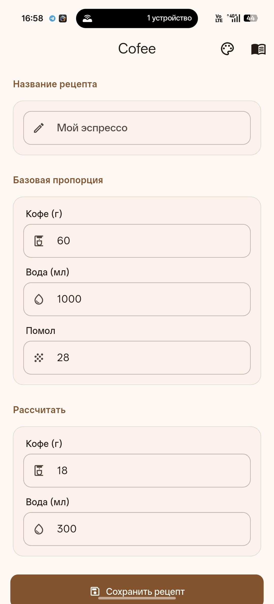
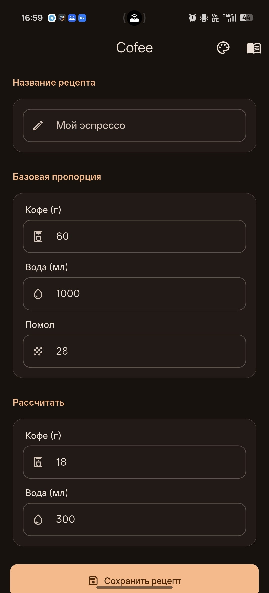
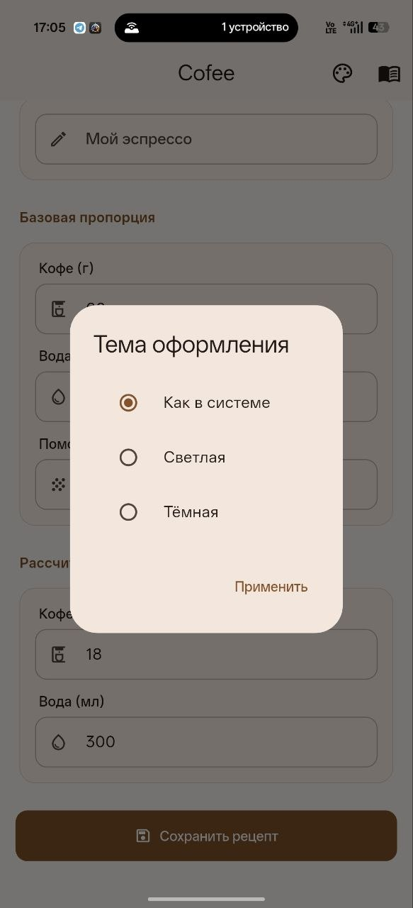
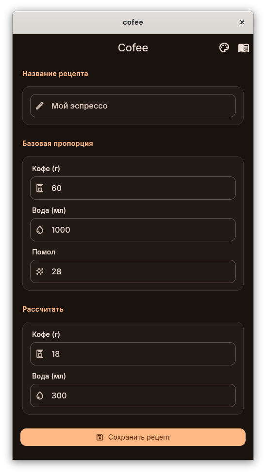
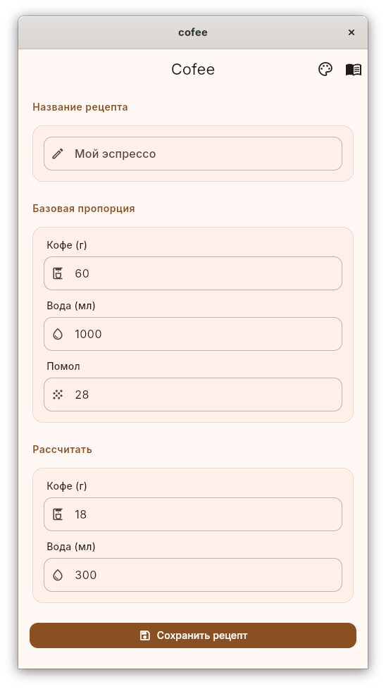
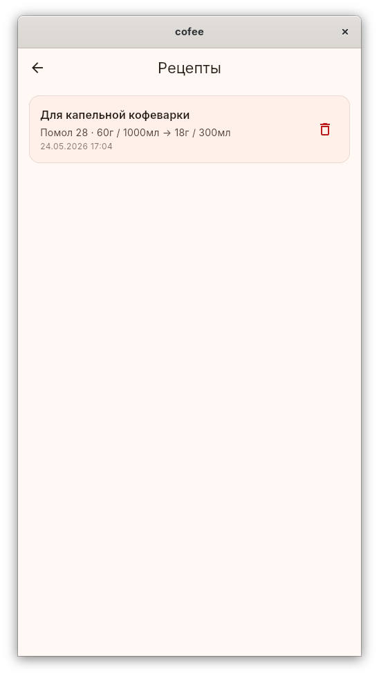
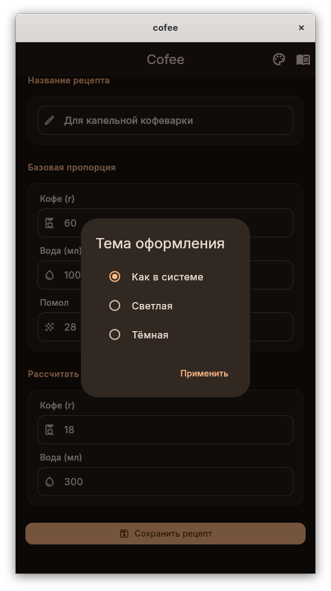

<p align="center">
  
  
  
</p>

<h1 align="center">☕ Cofee</h1>
<h3 align="center">Калькулятор пропорций кофе</h3>

<p align="center">
  Мобильное и десктопное приложение для расчёта идеальных пропорций
  кофе и воды. Задайте своё соотношение — всё остальное приложение
  посчитает само.
</p>

---

## 📋 Содержание

- [Возможности](#-возможности)
- [Скриншоты](#-скриншоты)
- [Как использовать](#-как-использовать)
- [Системные требования](#-системные-требования)
- [Сборка из исходников](#-сборка-из-исходников)
- [Технологии](#-технологии)
- [Downloads](#-downloads)
- [Лицензия](#-лицензия)

---

## ✨ Возможности

- **🎯 Произвольная пропорция** — задайте базовые значения кофе (г) и воды (мл). Например, 60 г на 1000 мл — и приложение рассчитает соотношение.
- **🔄 Двусторонний расчёт** — измените количество кофе → вода пересчитается автоматически, и наоборот.
- **⚙️ Помол** — сохраняйте номер помола вместе с каждым рецептом.
- **💾 Сохранение рецептов** — все рецепты хранятся локально на устройстве. Можно загрузить любой сохранённый рецепт в калькулятор одним нажатием.
- **🎨 Три темы оформления** — светлая, тёмная или системная (Material 3).

---

## 📸 Скриншоты

### Android

<p float="left">
  
  
  
</p>

### Linux

<p float="left">
  
  
</p>
<p float="left">
  
  
  
</p>

---

## 📖 Как использовать

1. **📲 Установите** приложение (см. [Downloads](#-downloads)).
2. **⚖️ Задайте базовую пропорцию**: например, кофе 60 г, вода 1000 мл.
3. **💧 Укажите желаемое количество** воды (или кофе) — второе поле рассчитается автоматически.
4. **⚙️ Укажите помол** и сохраните рецепт.
5. **📂 В разделе «Рецепты»** можно просмотреть, удалить или загрузить сохранённые рецепты.

---

## 💻 Системные требования

| Платформа | ОС | RAM | Место |
|-----------|-----|-----|-------|
| 📱 Android | Android 7.0+ (API 24) | от 2 ГБ | ~200 МБ |
| 🐧 Linux (x64) | glibc 2.31+, GTK 3.0+ | от 2 ГБ | ~200 МБ |

---

## 🔧 Сборка из исходников

### Требуемый toolchain

| Компонент | Версия | Назначение |
|-----------|--------|------------|
| **Flutter** (stable) | >= 3.5.0, Dart ^3.5.0 | Фреймворк |
| **Java JDK** | 17+ | Сборка Android |
| **Android SDK** | 34+ (platform 34) | Сборка Android |
| **Android NDK** | 28.2+ (устанавливается Gradle) | Нативные библиотеки |
| **Gradle** | 8.x (обёртка в проекте) | Система сборки |
| **Linux:** cmake, clang++, GTK3, pkg-config, ninja-build | — | Сборка Linux |

### Сборка

```bash
# Установить зависимости
flutter pub get

# Запустить на подключённом устройстве
flutter run

# Android (debug)
flutter build apk --debug
# → build/app/outputs/flutter-apk/app-debug.apk

# Android (release)
flutter build apk --release
# → build/app/outputs/flutter-apk/cofee-1.0.0-release.apk

# Linux x64 (debug)
flutter build linux --debug
# → build/linux/x64/debug/bundle/

# Linux x64 (release)
flutter build linux --release
# → build/linux/x64/release/bundle/
```

### 🛠️ Автоматизация (Makefile)

```bash
make android-release   # собрать Android release
make linux-release     # собрать Linux release
make help              # список всех целей
```

Makefile упаковывает Linux-бинарник в `cofee-{version}-linux-{variant}.tar.gz` автоматически.

### Примечания

- Android SDK и NDK загружаются автоматически при первой сборке через Gradle
- Для `flutter build apk --release` используется debug-подпись (не подходит для Google Play)
- APK переименовывается с указанием версии через Makefile (см. `Makefile`)

---

## 🛠️ Технологии

| Технология | Назначение |
|------------|------------|
| **Flutter / Dart** | Фреймворк |
| **Provider** | Управление состоянием |
| **path_provider** | Хранение рецептов (JSON) |
| **shared_preferences** | Сохранение темы |
| **Material Design 3** | Интерфейс |

---

## 📥 Downloads

| Платформа | Файл |
|-----------|------|
| 📱 Android | [cofee-1.0.0-release.apk](https://github.com/dmtsol/cofee/releases/download/v1.0.0/cofee-1.0.0-release.apk) |
| 🐧 Linux | [cofee-1.0.0-linux-release.tar.gz](https://github.com/dmtsol/cofee/releases/download/v1.0.0/cofee-1.0.0-linux-release.tar.gz) |

---

## 📄 Лицензия

Распространяется под лицензией **MIT**. См. файл [LICENSE](LICENSE).
